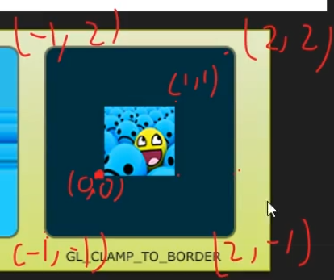
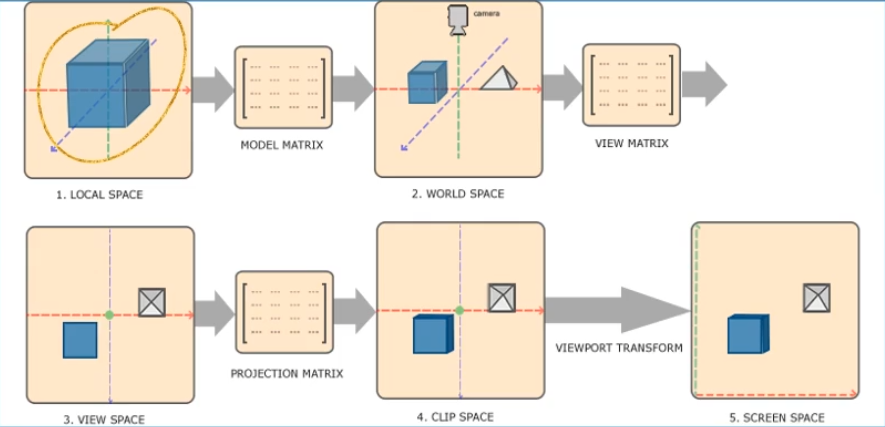

# 一、OpenGL介绍


## 状态机编程


object就是助理，助理是一个状态，一个子集是一系列参数的集合


# 二、QT中的opengl


# 三、VAO和VBO

- VAO只有一个类型，所以不需要绑定
- VBO可以有多个Buffer类型
- 都是一种状态


# 四、EBO

- 或者叫IBO
- 生成EBO 和 VBO的代码都是 如下，说明Buffer的类型有很多种，EBO和VBO都是Buffer，但是绑定了不同的Buffer类型

```c++
glGenBuffers(1,&EBO);
```

- GL_ELEMENT_ARRAY_BUFFER 是VAO的一个槽位
- EBO解绑之后会断开数据与VAO的连接
- EBO”下班“之后，可以使用 glDrawElements(GL_TRIANGLES,6,GL_UNSIGNED_INT,&indices); 


# 五、qt交互


# 六、qt对shader的封装

## 以往情况下的shader编译

```c++
const char *vertexShaderSource = "#version 450 core\n"
                                 "layout (location = 0) in vec3 aPos;\n"
                                 "void main()\n"
                                 "{ gl_Position = vec4(aPos.x,aPos.y,aPos.z,1.0f);}\0";

const char *fragmentShaderSource = "#version 450 core\n"
                                   "out vec4 FragColor;\n"
                                   "void main()\n"
                                   "{ FragColor = vec4(1.0f,0.5f,0.2f,1.0);}\0";
// 编译着色器
unsigned int vertexShader = glCreateShader(GL_VERTEX_SHADER);
glShaderSource(vertexShader,1,&vertexShaderSource,NULL);
glCompileShader(vertexShader);

unsigned int fragmentShader = glCreateShader(GL_FRAGMENT_SHADER);
glShaderSource(fragmentShader,1,&fragmentShaderSource,NULL);
glCompileShader(fragmentShader);

// 连接
shaderProgram = glCreateProgram();
glAttachShader(shaderProgram,vertexShader);
glAttachShader(shaderProgram,fragmentShader);
glLinkProgram(shaderProgram);

glDeleteShader(vertexShader);
glDeleteShader(fragmentShader);

```

## QOpenGLShaderProgram的封装

```c++
QOpenGLShaderProgram shaderProgram;
bool success;
shaderProgram.addShaderFromSourceCode(QOpenGLShader::Vertex,vertexShaderSource);
shaderProgram.addShaderFromSourceCode(QOpenGLShader::Fragment,fragmentShaderSource);
success = shaderProgram.link();
if(!success)
{
    qDebug() << "ERR:" << shaderProgram.log();
}
...
shaderProgram.bind()
```

## 从资源文件读取

```c++
shaderProgram.addShaderFromSourceFile(QOpenGLShader::Vertex,":/shaders/shapes.vert");
shaderProgram.addShaderFromSourceFile(QOpenGLShader::Fragment,":/shaders/shapes.frag");
```

# 七、shader

## 数据流向

- ### in

- ### out

- ### layout(location = n)    0<=n<=16

- ### uniform：可以被任意着色器程序在任意阶段访问

## 类型


## 重组


## 从VAO获取数据

### 第一种：查找shader程序中属性的location

```c++
shaderProgram.attributeLocation("aPos")
```

### 第二种：直接绑定，layout可以不设置

```c++
shaderProgram.bindAttributeLocation("aPos",posLocation);
```

### 第三种：手动设置

### 总结：只要确保数据和VAO的槽位对应即可

## 纹理

### 通过uniform读取纹理，opengl提供了16个纹理单元，默认取单元0

```glsl
uniform sampler2D texture;

void main()
{
    FragColor = texture(texture,ourTexcord);
};
```

### 读取纹理图

QT封装的库

```c++
#include <QOpenGLTexture>
```

```c++
// opengl y轴与图片是反的
texture = new QOpenGLTexture(QImage(":texture/texture/1.jpg").mirrored());
```

## uv

uv取值在0-1之间

### 设置环绕方式




这里注意前面绑定的是哪个纹理，在设置这个之前应当绑定纹理 texture->bind(n);


# 八、纹理过滤

- 图片的分辨率是有限的，当一个分辨率很**大的图片帧对一张比较小的纹理采样**时，多个采样点会落到同一个像素上，采用GL_NEAREST (就近返还)会产生**锯齿**
- GL_LINEAR对周围的点进行线性插值，综合的出一个颜色，会变得模糊


## 总结：纹理图片大时，就近即可，纹理图片小时，采用线性插值

```c++
// 纹理被缩小时，大纹理被缩小
glTexParameteri(GL_TEXTURE_2D,GL_TEXTURE_MIN_FILTER,GL_NEAREST);
// 纹理被拉伸，小纹理被拉伸
glTexParameteri(GL_TEXTURE_2D,GL_TEXTURE_MAG_FILTER,GL_LINEAR);
```

# 九、多级纹理（mipmap）

- 依然是处理纹理过小的情况，不同的是这个过小的纹理是我们自行生成的，以降低远处的纹理分辨率，减少不必要的开销，本质上是匹配和物体大小相适应的纹理尺寸


```c++
texSmall->bind(2);

// 生成多级纹理
texSmall->generateMipMaps();

float borderColor[] = {1.0f,1.0f,0.0};
glTexParameteri(GL_TEXTURE_2D,GL_TEXTURE_WRAP_T,GL_CLAMP_TO_BORDER);
glTexParameteri(GL_TEXTURE_2D,GL_TEXTURE_WRAP_S,GL_CLAMP_TO_BORDER);
glTexParameterfv(GL_TEXTURE_2D,GL_TEXTURE_BORDER_COLOR,borderColor);

glTexParameteri(GL_TEXTURE_2D,GL_TEXTURE_MIN_FILTER,GL_LINEAR_MIPMAP_LINEAR);
glTexParameteri(GL_TEXTURE_2D,GL_TEXTURE_MAG_FILTER,GL_NEAREST);

glDrawElements(GL_TRIANGLES,6,GL_UNSIGNED_INT,0);
```

# 十、开启alpha混合


# 十一、坐标


局部坐标系是指模型的局部




## MVP之后顶点数据已经在标准立方体内，三角面内的区域是插值得到的，这部分opengl已经实现

# 十二、视角


顺时针是正的